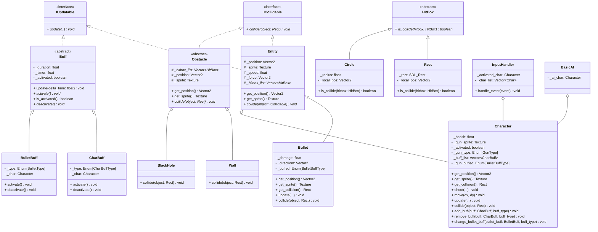

# GP2-shooter: A High-Performance 2D Shooter Game

## Overview
GP2-shooter is a 2D shooter game developed with a focus on low-level system interactions and efficient gameplay mechanics. Built directly on the SDL2 framework, this project demonstrates proficiency in fundamental game development concepts, custom physics implementations, and cross-platform build processes.

## Key Technical Highlights
*   **Low-Level Graphics & Input**: Direct utilization of **SDL2** for rendering, event handling, and audio management, showcasing a deep understanding of the core functionalities of a minimal game development framework.
*   **High-Performance Math & Physics**: Implementation of custom mathematical utilities, including a **Vector2** class, for precise entity positioning and movement. Advanced collision detection (e.g., OBB - Oriented Bounding Box, Circle-based collisions) is integrated, alongside foundational physics principles such as gravity, forces, and velocity management.
*   **Cross-Platform Development**: Engineered for compatibility across multiple operating systems, specifically **Linux**, **macOS**, and **Windows**, managed through a robust **Makefile** system.
*   **Modular Architecture**: The game features a component-based design, separating concerns into distinct modules like `AnimatedSprite`, `BasicAI`, `BuffItem`, `Bullet`, `Character`, `HitBox`, `InputHandler`, and `Obstacle` for maintainability and scalability.

## Architecture
The project's architecture, particularly the relationships between core components, is illustrated in the following class diagram:



## Building and Running

### Requirements

To build and run this project, you will need:
*   A **C++17 compatible compiler** (e.g., GCC, Clang).
*   The **`make` build tool**.

Additionally, you need the **SDL2 development libraries**: **SDL2**, **SDL2_image**, and **SDL2_ttf**.
Here's how to set them up for your operating system:

#### Linux (Debian/Ubuntu-based)
```bash
sudo apt-get update
sudo apt-get install libsdl2-dev libsdl2-image-dev libsdl2-ttf-dev
```

#### macOS (using Homebrew)
```bash
brew install sdl2 sdl2_image sdl2_ttf
```

#### Windows
For Windows, the necessary SDL2 libraries are conveniently included within the `win-deps` directory of this project. You do *not* need to install them separately.

However, to compile and run the project:
*   Install **MinGW-w64** (or another GCC-compatible compiler suite).
*   Install **Git for Windows**, which includes **Git Bash** and the `make` utility.
*   **Recommendation**: Perform all `make` commands within a **Git Bash** or **MSYS2 terminal** to ensure proper execution.

### Building the Project
The project utilizes a `Makefile` for streamlined compilation across different platforms.

```bash
make all
```

### Running the Game
After a successful build, you can run the game:

```bash
make run
```
On Windows, this command will also ensure that required DLLs are copied to the executable directory before launching the game.
