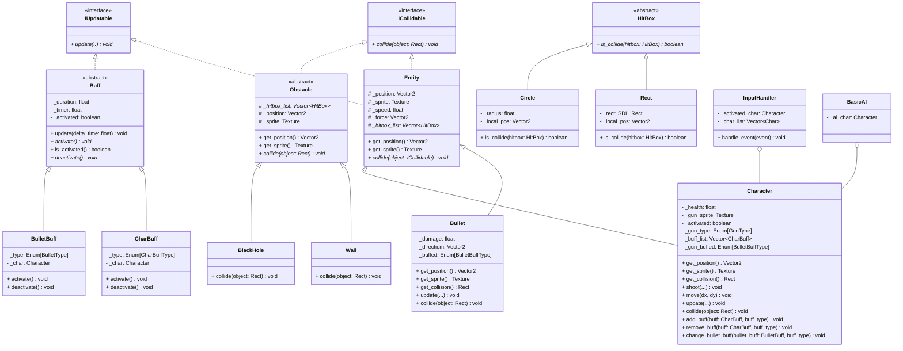

# Class Diagram

```mermaid
classDiagram
    ICollidable <|.. Entity
    ICollidable <|.. Obstacle
    IUpdatable <|.. Entity
    IUpdatable <|.. Buff
    Buff <|-- CharBuff
    Buff <|-- BulletBuff
	HitBox <|-- Rect
	HitBox <|-- Circle
    Entity <|-- Bullet
    Entity <|-- Character
    Obstacle <|-- Wall
    Obstacle <|-- BlackHole
    InputHandler o-- Character
    BasicAI o-- Character

    class IUpdatable {
        <<interface>>
        + update(..) void*
    }
    class ICollidable {
        <<interface>>
        + collide(object: Rect) void*
    }
    class Buff {
	    <<abstract>>
	    - _duration: float
	    - _timer: float
	    - _activated: boolean
		+ update(delta_time: float) void
		+ activate() void*
		+ is_activated() boolean
		+ deactivate() void*
    }
    class CharBuff {
	    - _type: Enum[CharBuffType]
	    - _char: Character
		+ activate() void
		+ deactivate() void
    }
    class BulletBuff {
	    - _type: Enum[BulletType]
	    - _char: Character
		+ activate() void
		+ deactivate() void
    }
    class HitBox {
	    <<abstract>>
	    + is_collide(hitbox: HitBox) boolean*
    }
    class Circle {
	    - _radius: float
	    - _local_pos: Vector2
	    + is_collide(hitbox: HitBox) boolean
    }
    class Rect {
	    - _rect: SDL_Rect
	    - _local_pos: Vector2
	    + is_collide(hitbox: HitBox) boolean
    }
    class Entity {
	    # _position: Vector2
		# _sprite: Texture
		# _speed: float
		# _force: Vector2
	    # _hitbox_list: Vector~HitBox~*
        + get_position() Vector2
        + get_sprite() Texture
		+ collide(object: ICollidable) void*
    }
    class Obstacle {
		<<abstract>>
        # _hitbox_list: Vector~HitBox~*
        # _position: Vector2
        # _sprite: Texture
        + get_position() Vector2
        + get_sprite() Texture
        + collide(object: Rect) void*
    }
    class InputHandler {
	    - _activated_char: Character
		- _char_list: Vector~Char~
	    + handle_event(event) void
    }
    class BasicAI {
		- _ai_char: Character
	      ...
    }
    class Character {
        - _health: float
	    - _gun_sprite: Texture
	    - _activated: boolean
        - _gun_type: Enum[GunType]
	    - _buff_list: Vector~CharBuff~
        - _gun_buffed: Enum[BulletBuffType]
        + get_position() Vector2
        + get_sprite() Texture
        + get_collision() Rect
	    + shoot(...) void
	    + move(dx, dy) void
	    + update(...) void
        + collide(object: Rect) void
		+ add_buff(buff: CharBuff, buff_type) void
		+ remove_buff(buff: CharBuff, buff_type) void
		+ change_bullet_buff(bullet_buff: BulletBuff, buff_type) void
    }
	class Bullet {
        - _damage: float
		- _directiom: Vector2
		- _buffed: Enum[BulletBuffType]
        + get_position() Vector2
        + get_sprite() Texture
        + get_collision() Rect
		+ update(...) void
        + collide(object: Rect) void
	}
    class Wall {
        + collide(object: Rect) void
    }
    class BlackHole {
        + collide(object: Rect) void
    }
```

